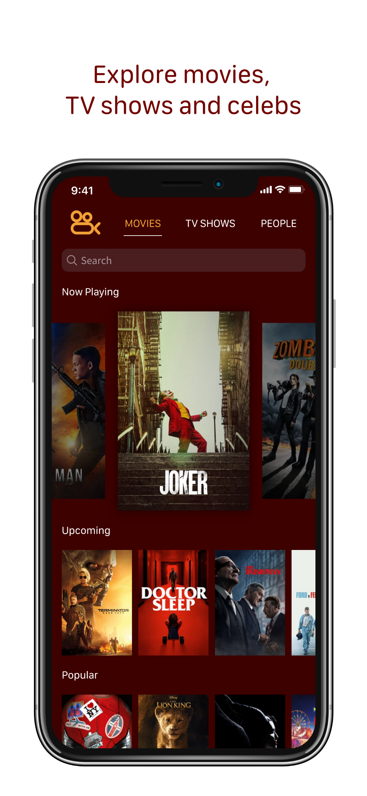
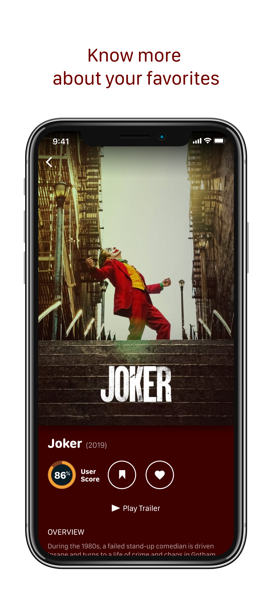

    

## About

Cinema is a personal project created by [me](https://github.com/matheusmpedrosa), Matheus Pedrosa, and written with [Israel Mesquita's](https://github.com/israelmesquita07) help. The project's main purpose is to demonstrate both developers skills, and hopefully go to the App Store in the future.

## App design

    
    

## Authors

<table>
<tr>
<td>
     
     
     Matheus Pedrosa

</td>
<td>
     
     
     Israel Mesquita

</td>
</tr> 
  </table>

## Open Source & Copying

In the spirit of openness, Cinema is licensed under MIT so that you can use my code in your app, if you choose.

However, please **do not ship this app** under your own account. Paid or free.
